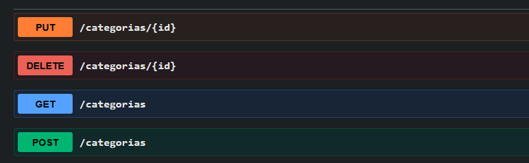
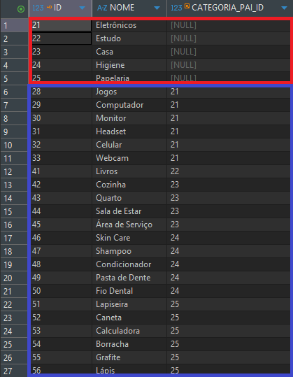
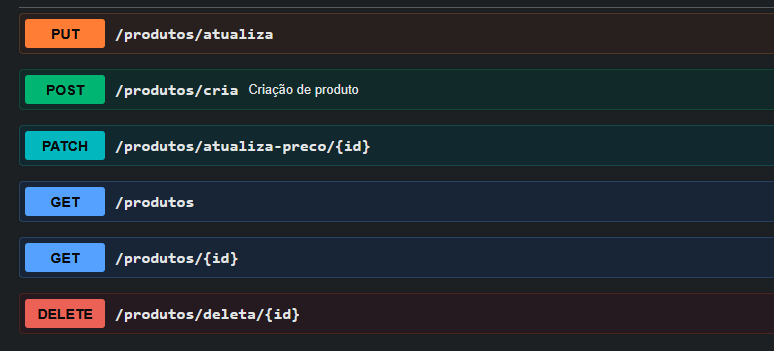
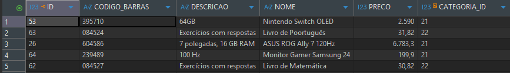
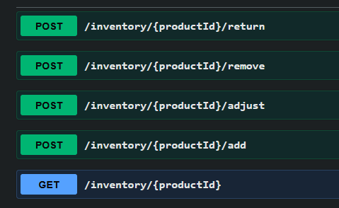
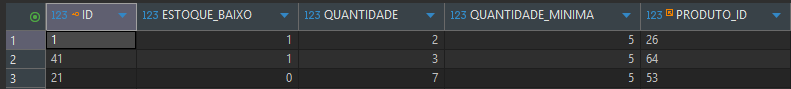
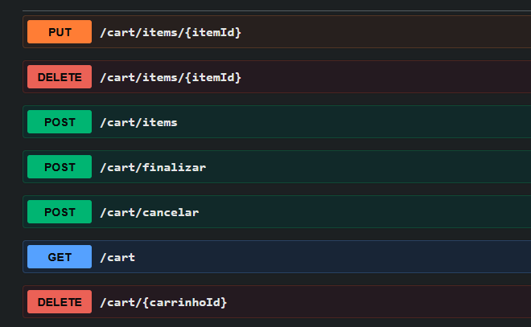
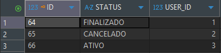
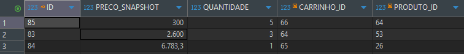

# Projeto Capacitção - Java & Oracle - 2026

Nesse projeto, consegui relembrar e aprimorar a minha capacidade com a linguagem Java, utilizando Banco de Dados Oracle com o auxílio do DBeaver, ferramenta que facilitou a visualização e manipulação dos dados nas tabelas criadas. Além disso, utilizei o Swagger para documentação e testes dos endpoints da API.

## Categorias e Organização do Catálogo

Inicialmente, foi criada a classe `Categorias` para os produtos. Cada produto pertence a uma categoria pai e a uma subcategoria filha, estabelecendo uma relação hierárquica (pai → filho).

Os requisitos para poder criar essa regra de negócio foi sugerido esses endpoints:


*Imagem dos Endpoints no Swagger*




Como pode ver na imagem acima eu criei as categorias Pai que está em vermelho, 
se for observar na coluna `CATEGORIA_PAI_ID` esta `NULL` 
porque eles que são a categoria pai. O que está em azul seria as categorias filho, 
por exemplo, a categoria Jogos é filha da categoria Eletrônicos porque na coluna da 
`CATEGORIA_PAI_ID` ela está apontado para o `ID` 21 que é o `ID` de eletrônicos.

```Java
@Service  
@RequiredArgsConstructor  
public class CategoriaService {  
  
    private final CategoriaRepository categoriaRepository;  
  
    public List<Categoria> getAll() { return categoriaRepository.findAll(); }  
  
    public Categoria criar(CategoriaDTO dto) {  
        try{  
            if (categoriaRepository.existsByNomeAndCategoriaPaiId(dto.nome(), dto.categoriaPaiId())) {  
                throw new RuntimeException("Ja existe uma categoria com esse nome neste nivel");  
            }  
  
            final var categoria = new Categoria();  
            categoria.setNome(dto.nome());  
  
            if (dto.categoriaPaiId() != null) {  
                final var pai = categoriaRepository.findById(dto.categoriaPaiId())  
                        .orElseThrow(() -> new RuntimeException("Categoria pai nao encontrada"));  
                categoria.setCategoriaPai(pai);  
        }  
            return categoriaRepository.save(categoria);  
        } catch (RuntimeException e) {  
            throw new RuntimeException("Erro ao criar categoria: " + e.getMessage());  
        }  
    }  
  
    public Categoria atualizar(Long id, CategoriaDTO dto) {  
        final var categoria = categoriaRepository.findById(id)  
                .orElseThrow(() -> new RuntimeException("Categoria nao encontrada"));  
        categoria.setNome(dto.nome());  
        return categoriaRepository.save(categoria);  
    }  
  
    public void deletar(Long id) {  
        categoriaRepository.deleteById(id);  
    }  
}
```

Este código é o `CategoriaService.java` onde nele tem as principais funções de criar, atualizar e deletar.

## Produtos

Para armazenar os dados do sistema foi criada a classe `Produto`. 
Cada produto tem o seu `ID`, `nome`, `codigo de barras`, `descrição`, `preço` e a `CategoriaID` 
na qual pertence.

Os requisitos para poder criar essa regra de negócio foi sugerido esses Endpoints:


*Imagem dos Endpoints no Swagger*



Pela imagem da para visualizar melhor o que consiste a classe `Produto`, cada produto tem o seu `ID` , `código de barras`, `preço`, `descrição` e o seu `nome` próprio, e todos eles estão ligados a uma categoria.


```Java
@Service  
@RequiredArgsConstructor  
public class ProdutosService {  
  
    private final ProdutosRepository produtosRepository;  
    private final HistoricoPrecoRepository historicoPrecoRepository;  
  
    public List<Produtos> getAll() {  
        return produtosRepository.findAll();  
    }  
  
    public Produtos createdProduto(Produtos produto) {  
        return produtosRepository.save(produto);  
    }  
  
    public Produtos atualiza(Produtos produto) {  
        return produtosRepository.save(produto);  
    }  
  
    public void deletarProduto(Long id) {  
        produtosRepository.deleteById(id);  
    }  
  
    public Produtos getById(Long id) {  
        try{  
            return produtosRepository.findById(id).orElseThrow(() -> new RuntimeException("Produto nao encontrado"));  
        } catch (RuntimeException e){  
            throw new RuntimeException("Erro ao buscar produto: " + e.getMessage());  
        }  
  
    }  
  
    public Produtos atualizaPreco(Long id, BigDecimal preco) {  
        try{  
            final var produto = produtosRepository.findById(id)  
                    .orElseThrow(() -> new RuntimeException("Produto não encontrado"));  
  
            final var historico = new HistoricoPreco();  
            historico.setPrecoAntigo(produto.getPreco());  
            historico.setPrecoNovo(preco);  
            historico.setProdutos(produto);  
            historicoPrecoRepository.save(historico);  
  
            produto.setPreco(preco);  
            return produtosRepository.saveAndFlush(produto);  
  
        } catch (RuntimeException e){  
            throw new RuntimeException("Erro ao atualizar preco: " + e.getMessage());  
        }  
  
  
    }  
}
```

Este código é o `ProdutoService.java` ele tem as funções de criar, atualizar e deletar os produtos que deseja.

Além disso, foi implementada uma funcionalidade de atualização de preço que registra 
o histórico de alterações por meio da entidade `HistoricoPreco`, 
garantindo rastreabilidade das mudanças.

## Controle de Estoque

Neste parte do projeto foi criada a regra de negócio de controle de estoque que 
dentro dela foi criado o `InventoryTransaction`, responsável por registrar movimentações de entrada e saída de produtos.

Quando um produto é vendido, o estoque é automaticamente reduzido. Caso não haja quantidade suficiente disponível, a operação é impedida.

Os requisitos para poder criar essa regra de negócio foi sugerido esses Endpoints, eu adicionei o 
- `POST /inventory/{productId}/adjust` 
- `POST /inventory/{productId}/return` 

Esses endpoints permitem ajustes manuais no estoque e o registro de devoluções de produtos.



*Imagem dos Endpoints no Swagger*



Também foi implementado um mecanismo de alerta para estoque baixo: 
quando a quantidade de um produto é inferior a 5 unidades, o sistema sinaliza essa condição.

```Java
@RestController  
@RequiredArgsConstructor  
@Tag(name = "Estoque", description = "Endpoints para controle de estoque")  
@RequestMapping("/inventory")  
  
public class EstoqueController {  
  
    private final EstoqueService estoqueService;  
  
    @PostMapping("/{productId}/add")  
    public ResponseEntity<EstoqueDTO> adicionar(@PathVariable Long productId,  
                                                @RequestBody TransacaoDTO dto) {  
        return ResponseEntity.ok(estoqueService.adicionar(productId, dto, TipoTransacao.ENTRADA));  
    }  
  
    @PostMapping("/{productId}/remove")  
    public ResponseEntity<EstoqueDTO> remover(@PathVariable Long productId,  
                                              @RequestBody TransacaoDTO dto) {  
        return ResponseEntity.ok(estoqueService.remover(productId, dto));  
    }  
  
    @GetMapping("/{productId}")  
    public ResponseEntity<EstoqueDTO> consultar(@PathVariable Long productId) {  
        return ResponseEntity.ok(estoqueService.consultar(productId));  
    }  
}
```
Este código é o `EstoqueService.java` onde nele tem as funções de adicionar, remover e consulta de estoque.

## Carrinho de Compra

Foi desenvolvido um sistema de carrinho de compras, no qual cada usuário pode 
possuir apenas um carrinho ativo por vez.

Uma funcionalidade importante implementada foi o priceSnapshot, 
que registra o preço do produto no momento em que ele é adicionado ao carrinho. 
Isso permite manter consistência nos valores, 
mesmo que o preço do produto seja alterado posteriormente.

Esses foram os Endpoints sugeridos, adicionei o `DELETE /cart/{carrinho}`, para apenas testar e depois deletar o carrinho para não poluir o banco de dados.



*Imagem dos Endpoints no Swagger*






Na estrutura do banco:

- Cada usuário possui um carrinho com diferentes status (ativo, finalizado ou cancelado);
- Os itens do carrinho armazenam a quantidade e o preço no momento da adição (`priceSnapshot`).

```Java
@Service  
@RequiredArgsConstructor  
public class CarrinhoService {  
  
    private final CarrinhoRepository carrinhoRepository;  
    private final CarrinhoItemRepository carrinhoItemRepository;  
    private final ProdutosRepository produtosRepository;  
  
    public CarrinhoDTO getCarrinho(Long userId) {  
        try {  
            final var carrinho = buscarOuCriarCarrinho(userId);  
            return toDTO(carrinho);  
        } catch (RuntimeException e) {  
            throw new RuntimeException("Erro ao buscar carrinho: " + e.getMessage());  
        }  
    }  
  
    public CarrinhoDTO adicionarItem(Long userId, Long produtoId, Integer quantidade) {  
        try {  
            final var carrinho = buscarOuCriarCarrinho(userId);  
            final var produto = produtosRepository.findById(produtoId)  
                    .orElseThrow(() -> new RuntimeException("Produto não encontrado"));  
            final var item = new CarrinhoItem();  
            item.setCarrinho(carrinho);  
            item.setProduto(produto);  
            item.setQuantidade(quantidade);  
            item.setPrecoSnapshot(produto.getPreco());  
            carrinhoItemRepository.save(item);  
            return toDTO(buscarOuCriarCarrinho(userId));  
        } catch (RuntimeException e) {  
            throw new RuntimeException("Erro ao adicionar item: " + e.getMessage());  
        }  
    }  
  
    public CarrinhoDTO atualizarItem(Long itemId, Integer quantidade) {  
        try {  
            final var item = carrinhoItemRepository.findById(itemId)  
                    .orElseThrow(() -> new RuntimeException("Item não encontrado"));  
            item.setQuantidade(quantidade);  
            carrinhoItemRepository.save(item);  
            return toDTO(item.getCarrinho());  
        } catch (RuntimeException e) {  
            throw new RuntimeException("Erro ao atualizar item: " + e.getMessage());  
        }  
    }  
  
    public CarrinhoDTO removerItem(Long itemId) {  
        try {  
            final var item = carrinhoItemRepository.findById(itemId)  
                    .orElseThrow(() -> new RuntimeException("Item não encontrado"));  
            final var carrinho = item.getCarrinho();  
            carrinhoItemRepository.delete(item);  
            return toDTO(carrinho);  
        } catch (RuntimeException e) {  
            throw new RuntimeException("Erro ao remover item: " + e.getMessage());  
        }  
    }  
  
    public void deletarCarrinho(Long carrinhoId) {  
        try {  
            final var carrinho = carrinhoRepository.findById(carrinhoId)  
                    .orElseThrow(() -> new RuntimeException("Carrinho nao encontrado"));  
  
            carrinhoRepository.delete(carrinho);  
  
        } catch (RuntimeException e) {  
            throw new RuntimeException("Erro ao deletar carrinho: " + e.getMessage());  
        }  
    }  
  
    private Carrinho buscarOuCriarCarrinho(Long userId) {  
        return carrinhoRepository.findByUserIdAndStatus(userId, StatusCarrinho.ATIVO)  
                .orElseGet(() -> {  
                    final var novoCarrinho = new Carrinho();  
                    novoCarrinho.setUserId(userId);  
                    novoCarrinho.setStatus(StatusCarrinho.ATIVO);  
                    return carrinhoRepository.save(novoCarrinho);  
                });  
    }  
  
    public CarrinhoDTO finalizarCarrinho(Long userID){  
        try{  
            final var carrinho = carrinhoRepository  
                    .findByUserIdAndStatus(userID, StatusCarrinho.ATIVO)  
                    .orElseThrow(() -> new RuntimeException("Carrinho nao encontrado"));  
  
            if(carrinho.getItens().isEmpty()){  
                throw new RuntimeException("Carrinho vazio nao pode ser finalizado");  
            }  
  
            carrinho.setStatus(StatusCarrinho.FINALIZADO);  
            carrinhoRepository.save(carrinho);  
  
            return toDTO(carrinho);  
        } catch (RuntimeException e){  
            throw new RuntimeException("Erro ao finalizar carrinho: " + e.getMessage());  
        }  
    }  
  
    public CarrinhoDTO cancelarCarrinho(Long userId){  
        try {  
            final var carrinho = carrinhoRepository  
                    .findByUserIdAndStatus(userId, StatusCarrinho.ATIVO)  
                    .orElseThrow(() -> new RuntimeException("Carrinho nao encontrado"));  
  
            carrinho.setStatus(StatusCarrinho.CANCELADO);  
            carrinhoRepository.save(carrinho);  
  
            return toDTO(carrinho);  
        } catch (RuntimeException e){  
            throw new RuntimeException("Erro ao cancelar carrinho: " + e.getMessage());  
        }  
    }  
  
    private CarrinhoDTO toDTO(Carrinho carrinho) {  
        final List<CarrinhoItemDTO> itens = carrinho.getItens().stream()  
                .map(i -> new CarrinhoItemDTO(  
                        i.getId(),  
                        i.getProduto().getId(),  
                        i.getProduto().getNome(),  
                        i.getQuantidade(),  
                        i.getPrecoSnapshot(),  
                        i.getPrecoSnapshot().multiply(BigDecimal.valueOf(i.getQuantidade()))  
                ))  
                .toList();  
  
        final var total = itens.stream()  
                .map(CarrinhoItemDTO::subtotal)  
                .reduce(BigDecimal.ZERO, BigDecimal::add);  
  
        return new CarrinhoDTO(  
                carrinho.getId(),  
                carrinho.getUserId(),  
                carrinho.getStatus(),  
                itens,  
                total  
        );  
    }  
}
```

Este código é o `CarrinhoService.java` onde nele tem as funções de adicionar, atualizar e remover os itens dentro do carrinho do usuário. Também tem as funções de deletar, finalizar e cancelar o carrinho.